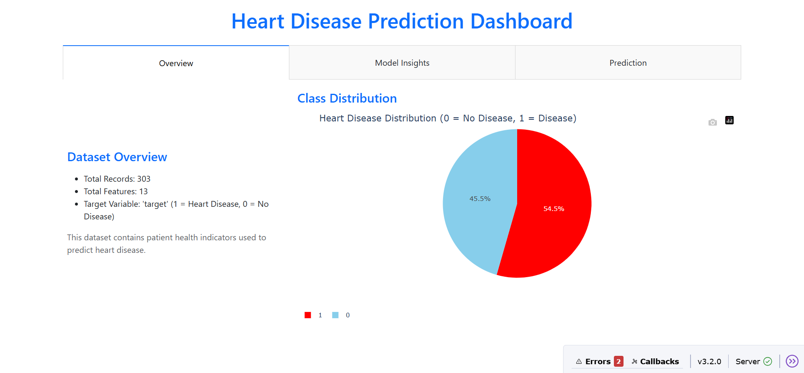

# ❤️ HeartSense 

### Distributed Healthcare Risk Prediction Engine using PySpark

An end-to-end machine learning system for predicting heart disease risk using distributed data processing with Apache Spark. HeartSense combines a PySpark Logistic Regression pipeline with an interactive Dash analytics dashboard, enabling real-time predictions, feature importance visualization, and exploratory healthcare analytics.

**Stack:** PySpark (MLlib) | Apache Spark | Logistic Regression | Dash | Plotly | Pandas | Matplotlib

---



---

# Table of Contents

- Overview
- Features
- System Architecture
- Dashboard
- Machine Learning Pipeline
- Dataset
- Project Structure
- Setup
- Running the Project
- Dashboard Walkthrough
- Model Performance
- Future Improvements
- Disclaimer

---

# Overview

Heart disease remains one of the leading causes of mortality worldwide. HeartSense provides an interpretable machine learning solution capable of estimating a patient's likelihood of heart disease using clinical health indicators.

The project leverages Apache Spark's distributed computing capabilities to train a Logistic Regression classifier while providing an interactive analytics dashboard for healthcare visualization and live inference.

Unlike traditional notebooks, HeartSense delivers:

- Distributed machine learning with PySpark
- Interactive healthcare analytics
- Explainable AI through feature importance visualization
- Real-time disease probability prediction
- Correlation analysis for clinical features

---

# Features

✅ Distributed Machine Learning Pipeline

✅ Feature Engineering using VectorAssembler

✅ Logistic Regression Classification

✅ Explainable AI (Coefficient-based Feature Importance)

✅ Interactive Dashboard

✅ Real-Time Prediction Interface

✅ Correlation Heatmap

✅ Dataset Analytics

---

# System Architecture

# System Architecture

```
                        Heart Disease Dataset (.csv)
                                   │
                                   ▼
                     Apache Spark DataFrame
                                   │
                                   ▼
                         Data Preprocessing
                    (Schema Inference & Cleaning)
                                   │
                                   ▼
                      Feature Engineering
                     (VectorAssembler)
                                   │
                                   ▼
                    Train/Test Split (80/20)
                                   │
                                   ▼
              PySpark Logistic Regression Model
                                   │
        ┌──────────────────────────┼──────────────────────────┐
        │                          │                          │
        ▼                          ▼                          ▼
  Model Evaluation         Feature Importance         Live Inference
 (BinaryClassification     (Coefficient Analysis)     (Probability)
      Evaluator)                   │                          │
        │                          │                          │
        └──────────────┬───────────┴───────────────┬──────────┘
                       ▼                           ▼
              Interactive Dash Dashboard
                       │
     ┌─────────────────┼─────────────────┐
     ▼                 ▼                 ▼
 Dataset Overview   Model Insights   Heart Disease Prediction
 (Statistics &      (Feature          (Real-Time Probability
 Distribution)      Importance &      Estimation)
                    Correlation)
```
---

# Dashboard

## Overview

Displays

- Dataset statistics
- Class distribution
- Number of features
- Target distribution

---

## Model Insights

Provides

- Feature Importance
- Correlation Heatmap

allowing users to understand which clinical variables contribute most toward disease prediction.

---

## Prediction

Users can enter

- Age
- Cholesterol
- Resting Blood Pressure
- Maximum Heart Rate
- ST Depression
- Sex

and instantly receive

- Heart Disease Probability
- Risk Classification

---

# Machine Learning Pipeline

The workflow follows an end-to-end distributed machine learning architecture.

### 1. Data Loading

The dataset is loaded into a Spark DataFrame with schema inference enabled.

```python
spark.read.csv(..., header=True, inferSchema=True)
```

---

### 2. Feature Engineering

Clinical variables are combined using

```
VectorAssembler
```

creating a single feature vector for model training.

---

### 3. Train/Test Split

```
80% Training
20% Testing
```

Random seed ensures reproducibility.

---

### 4. Model Training

The classifier is trained using

```
pyspark.ml.classification.LogisticRegression
```

---

### 5. Model Evaluation

Performance is measured using

```
BinaryClassificationEvaluator
```

achieving approximately

```
AUC ≈ 0.90
```

---

### 6. Explainability

Model coefficients are extracted to visualize

- Positive risk factors
- Negative risk factors
- Relative feature importance

This enables transparent interpretation of model predictions.

---

# Dataset

The project uses the UCI Heart Disease dataset.

| Property | Value |
|----------|-------|
| Records | 303 |
| Features | 13 |
| Target | Heart Disease (0 / 1) |

Clinical variables include

- Age
- Sex
- Chest Pain Type
- Cholesterol
- Resting Blood Pressure
- Maximum Heart Rate
- ST Depression
- Thalassemia
- Major Vessels
- Exercise-induced Angina

---

# Project Structure

```
HeartSense/
│
├── dashboard.py
├── logistic_regression.py
├── heart_disease_dataset.csv
├── requirements.txt
├── README.md
│
├── images/
│   ├── dashboard-overview.png
│   ├── model-insights.png
│   ├── prediction.png
│   └── feature-importance.png
│
└── notebooks/
    └── model_training.ipynb
```

---

# Setup

## Clone Repository

```bash
git clone https://github.com/MiteshPanda/HeartSense.git

cd HeartSense
```

---

## Create Environment

```bash
python -m venv venv

# Windows
venv\Scripts\activate
```

---

## Install Dependencies

```bash
pip install -r requirements.txt
```

---

# Running the Project

## Train the Model

```bash
python logistic_regression.py
```

---

## Launch Dashboard

```bash
python dashboard.py
```

Dashboard launches at

```
http://localhost:8050
```

---

# Dashboard Walkthrough

## Dataset Overview

Displays

- Total records
- Feature count
- Disease distribution

---

## Model Insights

Visualizes

- Feature Importance
- Feature Correlation Heatmap

These charts improve interpretability and explain how different clinical variables influence predictions.

---

## Live Prediction

Enter patient information to estimate

- Disease probability
- High/Low Risk classification

The prediction pipeline standardizes input features before performing inference with the trained Logistic Regression model.

---

# Model Performance

| Metric | Value |
|---------|------:|
| Algorithm | Logistic Regression |
| Framework | PySpark MLlib |
| Train/Test Split | 80 / 20 |
| Evaluation | Binary Classification Evaluator |
| AUC | ~0.90 |

---

# Future Improvements

- Gradient Boosted Trees
- Random Forest Classifier
- Hyperparameter Tuning
- SHAP Explainability
- Docker Deployment
- FastAPI REST API
- AWS Deployment
- Patient History Storage
- Model Monitoring

---

# Disclaimer

This project is intended for educational and research purposes only.

The predictions generated by HeartSense are not a substitute for professional medical diagnosis, treatment, or clinical decision-making.
